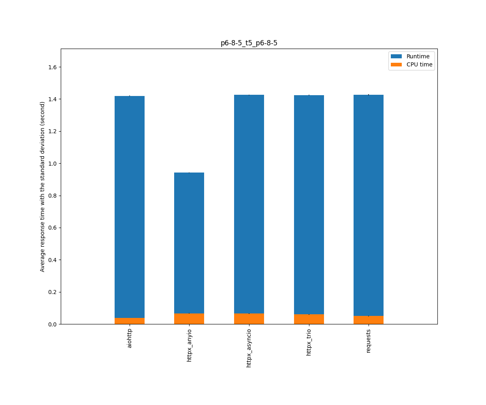
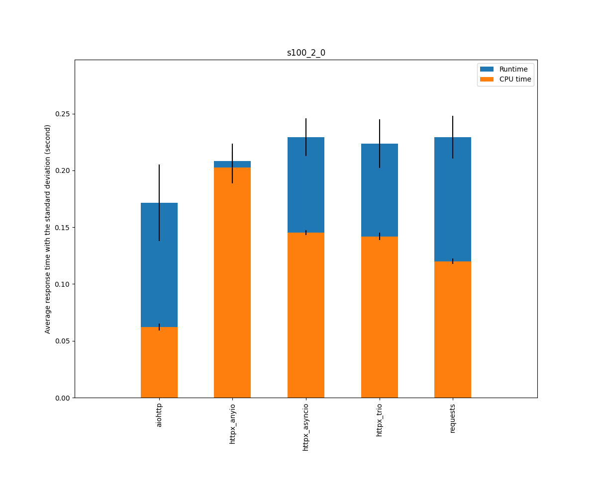

## Versions

* Python                         3.9.5 (default, Jun 24 2021, 21:08:46) [GCC 4.8.5 20150623 (Red Hat 4.8.5-44.0.2)]
* aiohttp                        3.7.4.post0
* httpx                          0.18.2
* httpcore                       0.13.6
* anyio                          3.2.1
* trio                           0.19.0
* requests                       2.25.1

## Context

* Cases: aiohttp, httpx_anyio, httpx_asyncio, httpx_trio, requests
* Scenarios: external_p6_t5_p6, p6-8-5_t5_p6-8-5, p6-400-5_t5_p6-400-5, p100-2-5_t5_p100-2-5, s100_1_0, s100_2_0, s100_256_0, s100_1024_0, s30_8_4, p100_2048_5_t20_p100_2048_5, p60_1024_5
* Tries: default

## Scenario external_p6_t5_p6: External requests: Two sequences of searx requests, 0.5s in between

|                                  | Runtime |         |         | Cputime |         |         |
|----------------------------------|---------|---------|---------|---------|---------|---------|
|                                  |  median |    mean |   stdev |  median |    mean |   stdev |
| aiohttp                          |    1.29 |    1.22 |    0.19 |    0.05 |    0.05 |    0.00 |
| httpx_anyio                      |    0.94 |    1.39 |    1.51 |    0.08 |    0.08 |    0.00 |
| httpx_asyncio                    |    1.23 |    1.28 |    0.26 |    0.06 |    0.06 |    0.00 |
| httpx_trio                       |    1.23 |    1.26 |    0.35 |    0.06 |    0.06 |    0.00 |
| requests                         |    1.35 |    1.30 |    0.15 |    0.09 |    0.09 |    0.01 |

## Scenario p6-8-5_t5_p6-8-5: Two sequences of 6 requests with a 8KB responses (various delays), 0.5s in between

|                                  | Runtime |         |         | Cputime |         |         |
|----------------------------------|---------|---------|---------|---------|---------|---------|
|                                  |  median |    mean |   stdev |  median |    mean |   stdev |
| aiohttp                          |    1.42 |    1.42 |    0.00 |    0.04 |    0.04 |    0.00 |
| httpx_anyio                      |    0.94 |    0.94 |    0.00 |    0.07 |    0.07 |    0.00 |
| httpx_asyncio                    |    1.43 |    1.43 |    0.00 |    0.06 |    0.06 |    0.00 |
| httpx_trio                       |    1.42 |    1.42 |    0.00 |    0.06 |    0.06 |    0.00 |
| requests                         |    1.43 |    1.43 |    0.00 |    0.05 |    0.05 |    0.00 |

## Scenario p6-400-5_t5_p6-400-5: Two sequences of 6 requests with a 400KB responses (various delays), 0.5s in between

|                                  | Runtime |         |         | Cputime |         |         |
|----------------------------------|---------|---------|---------|---------|---------|---------|
|                                  |  median |    mean |   stdev |  median |    mean |   stdev |
| aiohttp                          |    1.42 |    1.42 |    0.00 |    0.06 |    0.06 |    0.00 |
| httpx_anyio                      |    0.95 |    0.95 |    0.00 |    0.12 |    0.12 |    0.00 |
| httpx_asyncio                    |    1.43 |    1.43 |    0.00 |    0.12 |    0.12 |    0.00 |
| httpx_trio                       |    1.43 |    1.43 |    0.00 |    0.12 |    0.12 |    0.00 |
| requests                         |    1.43 |    1.43 |    0.00 |    0.06 |    0.08 |    0.08 |

## Scenario p100-2-5_t5_p100-2-5: Two sequences of 100 parallel requests (various delays), 0.5s in between

|                                  | Runtime |         |         | Cputime |         |         |
|----------------------------------|---------|---------|---------|---------|---------|---------|
|                                  |  median |    mean |   stdev |  median |    mean |   stdev |
| aiohttp                          |    2.00 |    2.02 |    0.05 |    0.38 |    0.38 |    0.01 |
| httpx_anyio                      |    2.09 |    2.09 |    0.01 |    1.04 |    1.04 |    0.01 |
| httpx_asyncio                    |    2.08 |    2.08 |    0.01 |    1.03 |    1.04 |    0.01 |
| httpx_trio                       |    2.07 |    2.06 |    0.01 |    0.98 |    0.98 |    0.01 |
| requests                         |    1.77 |    1.77 |    0.01 |    0.78 |    0.78 |    0.01 |

## Scenario s100_1_0: 100 sequential requests, 1 byte response, 0 delay

|                                  | Runtime |         |         | Cputime |         |         |
|----------------------------------|---------|---------|---------|---------|---------|---------|
|                                  |  median |    mean |   stdev |  median |    mean |   stdev |
| aiohttp                          |    0.13 |    0.14 |    0.02 |    0.06 |    0.06 |    0.00 |
| httpx_anyio                      |    0.19 |    0.19 |    0.00 |    0.18 |    0.19 |    0.00 |
| httpx_asyncio                    |    0.21 |    0.21 |    0.00 |    0.14 |    0.14 |    0.00 |
| httpx_trio                       |    0.19 |    0.19 |    0.00 |    0.13 |    0.13 |    0.00 |
| requests                         |    0.20 |    0.20 |    0.01 |    0.11 |    0.11 |    0.00 |

## Scenario s100_2_0: 100 sequential requests, 2KB response, 0 delay

|                                  | Runtime |         |         | Cputime |         |         |
|----------------------------------|---------|---------|---------|---------|---------|---------|
|                                  |  median |    mean |   stdev |  median |    mean |   stdev |
| aiohttp                          |    0.17 |    0.17 |    0.03 |    0.06 |    0.06 |    0.00 |
| httpx_anyio                      |    0.20 |    0.21 |    0.02 |    0.20 |    0.20 |    0.01 |
| httpx_asyncio                    |    0.22 |    0.23 |    0.02 |    0.15 |    0.15 |    0.00 |
| httpx_trio                       |    0.22 |    0.22 |    0.02 |    0.14 |    0.14 |    0.00 |
| requests                         |    0.23 |    0.23 |    0.02 |    0.12 |    0.12 |    0.00 |

## Scenario s100_256_0: 100 sequential requests, 256KB response, 0 delay

|                                  | Runtime |         |         | Cputime |         |         |
|----------------------------------|---------|---------|---------|---------|---------|---------|
|                                  |  median |    mean |   stdev |  median |    mean |   stdev |
| aiohttp                          |    0.26 |    0.26 |    0.01 |    0.17 |    0.17 |    0.00 |
| httpx_anyio                      |    0.88 |    0.88 |    0.01 |    0.88 |    0.88 |    0.01 |
| httpx_asyncio                    |    0.52 |    0.52 |    0.00 |    0.44 |    0.44 |    0.01 |
| httpx_trio                       |    0.55 |    0.55 |    0.01 |    0.48 |    0.47 |    0.01 |
| requests                         |    0.30 |    0.30 |    0.00 |    0.20 |    0.20 |    0.00 |

## Scenario s100_1024_0: 100 sequential requests, 1MB response, 0 delay

|                                  | Runtime |         |         | Cputime |         |         |
|----------------------------------|---------|---------|---------|---------|---------|---------|
|                                  |  median |    mean |   stdev |  median |    mean |   stdev |
| aiohttp                          |    0.60 |    0.61 |    0.03 |    0.50 |    0.50 |    0.03 |
| httpx_anyio                      |    1.84 |    1.84 |    0.02 |    1.83 |    1.84 |    0.03 |
| httpx_asyncio                    |    1.36 |    1.38 |    0.03 |    1.26 |    1.26 |    0.01 |
| httpx_trio                       |    1.51 |    1.51 |    0.04 |    1.40 |    1.40 |    0.02 |
| requests                         |    0.56 |    0.56 |    0.01 |    0.45 |    0.45 |    0.01 |

## Scenario s30_8_4: One sequence of 30 requests, 8KB response, 400ms delay

|                                  | Runtime |         |         | Cputime |         |         |
|----------------------------------|---------|---------|---------|---------|---------|---------|
|                                  |  median |    mean |   stdev |  median |    mean |   stdev |
| aiohttp                          |    0.48 |    0.49 |    0.01 |    0.08 |    0.08 |    0.00 |
| httpx_anyio                      |    0.52 |    0.53 |    0.01 |    0.16 |    0.17 |    0.01 |
| httpx_asyncio                    |    0.53 |    0.53 |    0.00 |    0.16 |    0.17 |    0.01 |
| httpx_trio                       |    0.52 |    0.52 |    0.01 |    0.15 |    0.16 |    0.04 |
| requests                         |    0.48 |    0.48 |    0.01 |    0.16 |    0.16 |    0.01 |

## Scenario p100_2048_5_t20_p100_2048_5: 2 sequences of 100 requests, between 2KB and 2MB responses (various delays), 2s in between

|                                  | Runtime |         |         | Cputime |         |         |
|----------------------------------|---------|---------|---------|---------|---------|---------|
|                                  |  median |    mean |   stdev |  median |    mean |   stdev |
| aiohttp                          |    3.00 |    3.00 |    0.01 |    0.77 |    0.78 |    0.02 |
| httpx_anyio                      |    2.84 |    2.84 |    0.05 |    2.39 |    2.40 |    0.04 |
| httpx_asyncio                    |    3.27 |    3.27 |    0.01 |    2.22 |    2.21 |    0.04 |
| httpx_trio                       |    3.28 |    3.29 |    0.01 |    2.26 |    2.26 |    0.03 |
| requests                         |    3.23 |    3.24 |    0.04 |    1.08 |    1.13 |    0.14 |

## Scenario p60_1024_5: 60 requests, 1MB response (various delays)

|                                  | Runtime |         |         | Cputime |         |         |
|----------------------------------|---------|---------|---------|---------|---------|---------|
|                                  |  median |    mean |   stdev |  median |    mean |   stdev |
| aiohttp                          |    1.11 |    1.11 |    0.01 |    0.42 |    0.42 |    0.00 |
| httpx_anyio                      |    1.25 |    1.25 |    0.01 |    1.03 |    1.03 |    0.01 |
| httpx_asyncio                    |    1.25 |    1.25 |    0.01 |    1.03 |    1.03 |    0.01 |
| httpx_trio                       |    1.32 |    1.31 |    0.02 |    1.08 |    1.08 |    0.02 |
| requests                         |    1.04 |    1.04 |    0.01 |    0.56 |    0.55 |    0.04 |

