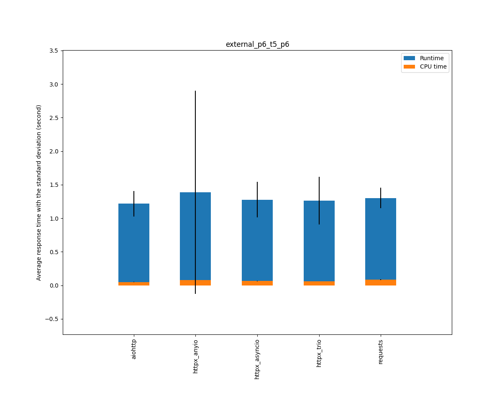
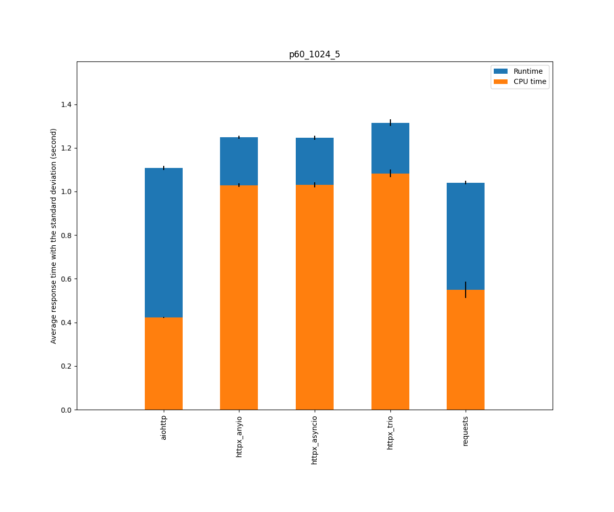

## Versions

* Python                         3.9.5 (default, Jun 24 2021, 21:08:46) [GCC 4.8.5 20150623 (Red Hat 4.8.5-44.0.2)]
* aiohttp                        3.7.4.post0
* httpx                          0.18.2
* httpcore                       0.13.6
* requests                       2.25.1
* uvloop                         0.15.2
* trio                           0.19.0
* curio                          1.5
* anyio                          3.2.1

## Context

* Cases: aiohttp, httpcore_curio_http2, httpcore_curio_http1, httpcore_trio_http2, httpcore_trio_http1, httpcore_uvloop_asyncio_http2, httpcore_uvloop_anyio_http2, httpcore_uvloop_asyncio_http1, httpcore_uvloop_anyio_http1, httpx_uvloop_http2, httpx_uvloop_http1, requests_1, requests_4
* Scenarios: external_p6_t5_p6, p6-8-5_t5_p6-8-5, p6-400-5_t5_p6-400-5, p100-2-5_t5_p100-2-5, s100_1_0, s100_2_0, s100_256_0, s100_1024_0, s30_8_4, p100_2048_5_t20_p100_2048_5, p60_1024_5
* Tries: default

## Scenario external_p6_t5_p6: External requests: Two sequences of searx requests, 0.5s in between

|                                  | Runtime |         |         | Cputime |         |         |
|----------------------------------|---------|---------|---------|---------|---------|---------|
|                                  |  median |    mean |   stdev |  median |    mean |   stdev |
| aiohttp                          |    1.13 |    1.18 |    0.15 |    0.04 |    0.04 |    0.00 |
| httpcore_curio_http2             |    1.09 |    1.15 |    0.13 |    0.06 |    0.06 |    0.01 |
| httpcore_curio_http1             |    1.12 |    1.10 |    0.07 |    0.05 |    0.05 |    0.01 |
| httpcore_trio_http2              |    1.05 |    1.07 |    0.10 |    0.07 |    0.07 |    0.02 |
| httpcore_trio_http1              |    1.30 |    1.25 |    0.13 |    0.06 |    0.06 |    0.01 |
| httpcore_uvloop_asyncio_http2    |    1.05 |    1.09 |    0.10 |    0.05 |    0.05 |    0.01 |
| httpcore_uvloop_anyio_http2      |    1.21 |    1.18 |    0.12 |    0.06 |    0.06 |    0.00 |
| httpcore_uvloop_asyncio_http1    |    1.33 |    1.73 |    1.54 |    0.04 |    0.04 |    0.01 |
| httpcore_uvloop_anyio_http1      |    1.13 |    1.20 |    0.16 |    0.05 |    0.05 |    0.01 |
| httpx_uvloop_http2               |    1.07 |    1.12 |    0.10 |    0.07 |    0.07 |    0.00 |
| httpx_uvloop_http1               |    1.09 |    1.16 |    0.18 |    0.06 |    0.06 |    0.01 |
| requests_1                       |    1.08 |    1.13 |    0.20 |    0.11 |    0.11 |    0.02 |
| requests_4                       |    1.13 |    1.17 |    0.11 |    0.14 |    0.14 |    0.02 |

## Scenario p6-8-5_t5_p6-8-5: Two sequences of 6 requests with a 8KB responses (various delays), 0.5s in between

|                                  | Runtime |         |         | Cputime |         |         |
|----------------------------------|---------|---------|---------|---------|---------|---------|
|                                  |  median |    mean |   stdev |  median |    mean |   stdev |
| aiohttp                          |    1.42 |    1.42 |    0.00 |    0.03 |    0.03 |    0.00 |
| httpcore_curio_http2             |    1.40 |    1.40 |    0.00 |    0.04 |    0.04 |    0.01 |
| httpcore_curio_http1             |    1.42 |    1.42 |    0.00 |    0.04 |    0.04 |    0.00 |
| httpcore_trio_http2              |    1.41 |    1.41 |    0.00 |    0.04 |    0.04 |    0.00 |
| httpcore_trio_http1              |    1.42 |    1.42 |    0.01 |    0.05 |    0.05 |    0.00 |
| httpcore_uvloop_asyncio_http2    |    1.40 |    1.40 |    0.00 |    0.03 |    0.03 |    0.00 |
| httpcore_uvloop_anyio_http2      |    1.40 |    1.40 |    0.00 |    0.04 |    0.04 |    0.00 |
| httpcore_uvloop_asyncio_http1    |    1.42 |    1.42 |    0.00 |    0.03 |    0.03 |    0.00 |
| httpcore_uvloop_anyio_http1      |    1.42 |    1.42 |    0.00 |    0.05 |    0.05 |    0.00 |
| httpx_uvloop_http2               |    1.41 |    1.41 |    0.00 |    0.05 |    0.05 |    0.00 |
| httpx_uvloop_http1               |    1.42 |    1.42 |    0.00 |    0.06 |    0.06 |    0.01 |
| requests_1                       |    1.42 |    1.42 |    0.00 |    0.05 |    0.05 |    0.01 |
| requests_4                       |    1.42 |    1.42 |    0.00 |    0.06 |    0.07 |    0.01 |

## Scenario p6-400-5_t5_p6-400-5: Two sequences of 6 requests with a 400KB responses (various delays), 0.5s in between

|                                  | Runtime |         |         | Cputime |         |         |
|----------------------------------|---------|---------|---------|---------|---------|---------|
|                                  |  median |    mean |   stdev |  median |    mean |   stdev |
| aiohttp                          |    1.42 |    1.42 |    0.00 |    0.05 |    0.05 |    0.00 |
| httpcore_curio_http2             |    1.41 |    1.41 |    0.00 |    0.10 |    0.10 |    0.01 |
| httpcore_curio_http1             |    1.42 |    1.42 |    0.00 |    0.07 |    0.07 |    0.00 |
| httpcore_trio_http2              |    1.41 |    1.42 |    0.01 |    0.12 |    0.12 |    0.00 |
| httpcore_trio_http1              |    1.43 |    1.43 |    0.00 |    0.09 |    0.09 |    0.00 |
| httpcore_uvloop_asyncio_http2    |    1.41 |    1.41 |    0.00 |    0.06 |    0.06 |    0.00 |
| httpcore_uvloop_anyio_http2      |    1.41 |    1.41 |    0.00 |    0.10 |    0.10 |    0.00 |
| httpcore_uvloop_asyncio_http1    |    1.42 |    1.42 |    0.00 |    0.05 |    0.05 |    0.00 |
| httpcore_uvloop_anyio_http1      |    1.43 |    1.43 |    0.00 |    0.08 |    0.08 |    0.00 |
| httpx_uvloop_http2               |    1.41 |    1.42 |    0.00 |    0.13 |    0.13 |    0.00 |
| httpx_uvloop_http1               |    1.43 |    1.43 |    0.00 |    0.11 |    0.11 |    0.00 |
| requests_1                       |    1.42 |    1.42 |    0.00 |    0.06 |    0.06 |    0.01 |
| requests_4                       |    1.42 |    1.42 |    0.00 |    0.07 |    0.07 |    0.01 |

## Scenario p100-2-5_t5_p100-2-5: Two sequences of 100 parallel requests (various delays), 0.5s in between

|                                  | Runtime |         |         | Cputime |         |         |
|----------------------------------|---------|---------|---------|---------|---------|---------|
|                                  |  median |    mean |   stdev |  median |    mean |   stdev |
| aiohttp                          |    1.99 |    2.00 |    0.04 |    0.35 |    0.35 |    0.01 |
| httpcore_curio_http2             |    1.44 |    1.45 |    0.00 |    0.55 |    0.55 |    0.01 |
| httpcore_curio_http1             |    1.71 |    1.71 |    0.01 |    0.67 |    0.68 |    0.02 |
| httpcore_trio_http2              |    1.46 |    1.46 |    0.00 |    0.32 |    0.32 |    0.01 |
| httpcore_trio_http1              |    1.68 |    1.68 |    0.01 |    0.68 |    0.68 |    0.01 |
| httpcore_uvloop_asyncio_http2    |    1.44 |    1.44 |    0.00 |    0.37 |    0.37 |    0.00 |
| httpcore_uvloop_anyio_http2      |    1.46 |    1.46 |    0.00 |    0.28 |    0.28 |    0.01 |
| httpcore_uvloop_asyncio_http1    |    1.67 |    1.68 |    0.02 |    0.49 |    0.49 |    0.01 |
| httpcore_uvloop_anyio_http1      |    1.66 |    1.66 |    0.01 |    0.61 |    0.61 |    0.01 |
| httpx_uvloop_http2               |    1.49 |    1.49 |    0.01 |    0.38 |    0.38 |    0.01 |
| httpx_uvloop_http1               |    2.05 |    2.05 |    0.01 |    0.86 |    0.86 |    0.02 |
| requests_1                       |    1.60 |    1.60 |    0.01 |    0.81 |    0.84 |    0.06 |
| requests_4                       |    1.63 |    1.62 |    0.02 |    0.92 |    0.90 |    0.08 |

## Scenario s100_1_0: 100 sequential requests, 1 byte response, 0 delay

|                                  | Runtime |         |         | Cputime |         |         |
|----------------------------------|---------|---------|---------|---------|---------|---------|
|                                  |  median |    mean |   stdev |  median |    mean |   stdev |
| aiohttp                          |    0.13 |    0.13 |    0.00 |    0.05 |    0.05 |    0.00 |
| httpcore_curio_http2             |    0.18 |    0.18 |    0.00 |    0.09 |    0.09 |    0.00 |
| httpcore_curio_http1             |    0.13 |    0.13 |    0.00 |    0.06 |    0.06 |    0.00 |
| httpcore_trio_http2              |    0.19 |    0.20 |    0.00 |    0.12 |    0.12 |    0.00 |
| httpcore_trio_http1              |    0.14 |    0.15 |    0.00 |    0.08 |    0.09 |    0.00 |
| httpcore_uvloop_asyncio_http2    |    0.16 |    0.16 |    0.00 |    0.07 |    0.07 |    0.00 |
| httpcore_uvloop_anyio_http2      |    0.19 |    0.19 |    0.00 |    0.11 |    0.11 |    0.00 |
| httpcore_uvloop_asyncio_http1    |    0.14 |    0.14 |    0.00 |    0.05 |    0.05 |    0.00 |
| httpcore_uvloop_anyio_http1      |    0.15 |    0.15 |    0.00 |    0.08 |    0.08 |    0.00 |
| httpx_uvloop_http2               |    0.26 |    0.26 |    0.00 |    0.17 |    0.17 |    0.00 |
| httpx_uvloop_http1               |    0.20 |    0.20 |    0.00 |    0.13 |    0.13 |    0.00 |
| requests_1                       |    0.20 |    0.20 |    0.00 |    0.12 |    0.12 |    0.00 |
| requests_4                       |    0.22 |    0.22 |    0.00 |    0.12 |    0.12 |    0.00 |

## Scenario s100_2_0: 100 sequential requests, 2KB response, 0 delay

|                                  | Runtime |         |         | Cputime |         |         |
|----------------------------------|---------|---------|---------|---------|---------|---------|
|                                  |  median |    mean |   stdev |  median |    mean |   stdev |
| aiohttp                          |    0.14 |    0.14 |    0.00 |    0.05 |    0.05 |    0.00 |
| httpcore_curio_http2             |    0.18 |    0.18 |    0.00 |    0.09 |    0.09 |    0.00 |
| httpcore_curio_http1             |    0.13 |    0.13 |    0.00 |    0.06 |    0.06 |    0.00 |
| httpcore_trio_http2              |    0.20 |    0.20 |    0.00 |    0.12 |    0.12 |    0.00 |
| httpcore_trio_http1              |    0.15 |    0.15 |    0.00 |    0.09 |    0.09 |    0.00 |
| httpcore_uvloop_asyncio_http2    |    0.17 |    0.17 |    0.01 |    0.07 |    0.07 |    0.00 |
| httpcore_uvloop_anyio_http2      |    0.19 |    0.19 |    0.00 |    0.11 |    0.11 |    0.00 |
| httpcore_uvloop_asyncio_http1    |    0.14 |    0.14 |    0.00 |    0.05 |    0.05 |    0.00 |
| httpcore_uvloop_anyio_http1      |    0.15 |    0.15 |    0.00 |    0.08 |    0.08 |    0.00 |
| httpx_uvloop_http2               |    0.27 |    0.27 |    0.00 |    0.17 |    0.17 |    0.00 |
| httpx_uvloop_http1               |    0.22 |    0.22 |    0.00 |    0.14 |    0.14 |    0.00 |
| requests_1                       |    0.21 |    0.21 |    0.00 |    0.12 |    0.12 |    0.00 |
| requests_4                       |    0.23 |    0.23 |    0.00 |    0.13 |    0.13 |    0.00 |

## Scenario s100_256_0: 100 sequential requests, 256KB response, 0 delay

|                                  | Runtime |         |         | Cputime |         |         |
|----------------------------------|---------|---------|---------|---------|---------|---------|
|                                  |  median |    mean |   stdev |  median |    mean |   stdev |
| aiohttp                          |    0.24 |    0.24 |    0.00 |    0.15 |    0.15 |    0.00 |
| httpcore_curio_http2             |    0.61 |    0.61 |    0.01 |    0.41 |    0.41 |    0.01 |
| httpcore_curio_http1             |    0.26 |    0.26 |    0.00 |    0.19 |    0.19 |    0.00 |
| httpcore_trio_http2              |    0.58 |    0.58 |    0.01 |    0.50 |    0.50 |    0.01 |
| httpcore_trio_http1              |    0.38 |    0.38 |    0.01 |    0.31 |    0.32 |    0.01 |
| httpcore_uvloop_asyncio_http2    |    0.31 |    0.31 |    0.00 |    0.21 |    0.21 |    0.00 |
| httpcore_uvloop_anyio_http2      |    0.49 |    0.49 |    0.01 |    0.40 |    0.40 |    0.01 |
| httpcore_uvloop_asyncio_http1    |    0.23 |    0.23 |    0.00 |    0.15 |    0.15 |    0.00 |
| httpcore_uvloop_anyio_http1      |    0.32 |    0.32 |    0.00 |    0.25 |    0.25 |    0.00 |
| httpx_uvloop_http2               |    0.67 |    0.67 |    0.01 |    0.57 |    0.57 |    0.01 |
| httpx_uvloop_http1               |    0.51 |    0.51 |    0.01 |    0.42 |    0.42 |    0.01 |
| requests_1                       |    0.30 |    0.30 |    0.00 |    0.20 |    0.20 |    0.00 |
| requests_4                       |    0.32 |    0.32 |    0.00 |    0.21 |    0.21 |    0.00 |

## Scenario s100_1024_0: 100 sequential requests, 1MB response, 0 delay

|                                  | Runtime |         |         | Cputime |         |         |
|----------------------------------|---------|---------|---------|---------|---------|---------|
|                                  |  median |    mean |   stdev |  median |    mean |   stdev |
| aiohttp                          |    0.55 |    0.56 |    0.02 |    0.45 |    0.45 |    0.01 |
| httpcore_curio_http2             |    1.72 |    1.73 |    0.05 |    1.33 |    1.34 |    0.04 |
| httpcore_curio_http1             |    0.63 |    0.64 |    0.02 |    0.56 |    0.56 |    0.02 |
| httpcore_trio_http2              |    1.72 |    1.72 |    0.04 |    1.62 |    1.62 |    0.04 |
| httpcore_trio_http1              |    0.99 |    0.99 |    0.02 |    0.91 |    0.91 |    0.01 |
| httpcore_uvloop_asyncio_http2    |    0.76 |    0.77 |    0.02 |    0.66 |    0.67 |    0.02 |
| httpcore_uvloop_anyio_http2      |    1.34 |    1.35 |    0.03 |    1.23 |    1.24 |    0.02 |
| httpcore_uvloop_asyncio_http1    |    0.48 |    0.49 |    0.02 |    0.39 |    0.40 |    0.01 |
| httpcore_uvloop_anyio_http1      |    0.79 |    0.80 |    0.02 |    0.72 |    0.72 |    0.02 |
| httpx_uvloop_http2               |    1.81 |    1.83 |    0.06 |    1.69 |    1.70 |    0.04 |
| httpx_uvloop_http1               |    1.31 |    1.32 |    0.04 |    1.21 |    1.22 |    0.04 |
| requests_1                       |    0.57 |    0.57 |    0.01 |    0.46 |    0.46 |    0.01 |
| requests_4                       |    0.59 |    0.59 |    0.01 |    0.46 |    0.47 |    0.01 |

## Scenario s30_8_4: One sequence of 30 requests, 8KB response, 400ms delay

|                                  | Runtime |         |         | Cputime |         |         |
|----------------------------------|---------|---------|---------|---------|---------|---------|
|                                  |  median |    mean |   stdev |  median |    mean |   stdev |
| aiohttp                          |    0.48 |    0.48 |    0.01 |    0.07 |    0.07 |    0.00 |
| httpcore_curio_http2             |    0.51 |    0.51 |    0.00 |    0.14 |    0.14 |    0.00 |
| httpcore_curio_http1             |    0.49 |    0.49 |    0.00 |    0.11 |    0.11 |    0.00 |
| httpcore_trio_http2              |    0.50 |    0.50 |    0.00 |    0.12 |    0.12 |    0.00 |
| httpcore_trio_http1              |    0.50 |    0.50 |    0.00 |    0.12 |    0.12 |    0.00 |
| httpcore_uvloop_asyncio_http2    |    0.50 |    0.50 |    0.00 |    0.10 |    0.10 |    0.00 |
| httpcore_uvloop_anyio_http2      |    0.49 |    0.48 |    0.00 |    0.10 |    0.10 |    0.00 |
| httpcore_uvloop_asyncio_http1    |    0.48 |    0.48 |    0.00 |    0.08 |    0.07 |    0.00 |
| httpcore_uvloop_anyio_http1      |    0.50 |    0.50 |    0.00 |    0.11 |    0.11 |    0.00 |
| httpx_uvloop_http2               |    0.49 |    0.49 |    0.01 |    0.11 |    0.11 |    0.01 |
| httpx_uvloop_http1               |    0.51 |    0.51 |    0.00 |    0.14 |    0.14 |    0.00 |
| requests_1                       |    0.47 |    0.47 |    0.00 |    0.15 |    0.15 |    0.00 |
| requests_4                       |    0.47 |    0.47 |    0.00 |    0.15 |    0.15 |    0.00 |

## Scenario p100_2048_5_t20_p100_2048_5: 2 sequences of 100 requests, between 2KB and 2MB responses (various delays), 2s in between

|                                  | Runtime |         |         | Cputime |         |         |
|----------------------------------|---------|---------|---------|---------|---------|---------|
|                                  |  median |    mean |   stdev |  median |    mean |   stdev |
| aiohttp                          |    3.01 |    3.01 |    0.00 |    0.68 |    0.68 |    0.00 |
| httpcore_curio_http2             |    3.19 |    3.19 |    0.01 |    1.81 |    1.82 |    0.03 |
| httpcore_curio_http1             |    3.00 |    3.01 |    0.00 |    0.90 |    0.91 |    0.01 |
| httpcore_trio_http2              |    3.26 |    3.26 |    0.01 |    1.89 |    1.89 |    0.01 |
| httpcore_trio_http1              |    3.08 |    3.08 |    0.00 |    1.37 |    1.37 |    0.02 |
| httpcore_uvloop_asyncio_http2    |    3.07 |    3.07 |    0.00 |    1.01 |    1.01 |    0.01 |
| httpcore_uvloop_anyio_http2      |    3.18 |    3.18 |    0.01 |    1.53 |    1.54 |    0.01 |
| httpcore_uvloop_asyncio_http1    |    3.00 |    3.00 |    0.00 |    0.62 |    0.62 |    0.00 |
| httpcore_uvloop_anyio_http1      |    3.05 |    3.05 |    0.00 |    1.13 |    1.13 |    0.02 |
| httpx_uvloop_http2               |    3.43 |    3.43 |    0.03 |    2.20 |    2.20 |    0.05 |
| httpx_uvloop_http1               |    3.23 |    3.24 |    0.01 |    1.98 |    1.98 |    0.03 |
| requests_1                       |    3.01 |    3.01 |    0.00 |    1.03 |    1.03 |    0.03 |
| requests_4                       |    3.11 |    3.09 |    0.04 |    1.33 |    1.29 |    0.14 |

## Scenario p60_1024_5: 60 requests, 1MB response (various delays)

|                                  | Runtime |         |         | Cputime |         |         |
|----------------------------------|---------|---------|---------|---------|---------|---------|
|                                  |  median |    mean |   stdev |  median |    mean |   stdev |
| aiohttp                          |    1.08 |    1.09 |    0.01 |    0.38 |    0.38 |    0.00 |
| httpcore_curio_http2             |    1.29 |    1.30 |    0.02 |    1.00 |    1.00 |    0.02 |
| httpcore_curio_http1             |    1.14 |    1.14 |    0.01 |    0.51 |    0.51 |    0.01 |
| httpcore_trio_http2              |    1.46 |    1.46 |    0.01 |    1.11 |    1.11 |    0.01 |
| httpcore_trio_http1              |    1.14 |    1.13 |    0.01 |    0.75 |    0.75 |    0.01 |
| httpcore_uvloop_asyncio_http2    |    1.15 |    1.15 |    0.01 |    0.54 |    0.54 |    0.01 |
| httpcore_uvloop_anyio_http2      |    1.26 |    1.26 |    0.02 |    0.89 |    0.90 |    0.02 |
| httpcore_uvloop_asyncio_http1    |    1.09 |    1.10 |    0.01 |    0.35 |    0.35 |    0.00 |
| httpcore_uvloop_anyio_http1      |    1.12 |    1.12 |    0.01 |    0.61 |    0.61 |    0.01 |
| httpx_uvloop_http2               |    1.60 |    1.60 |    0.01 |    1.23 |    1.23 |    0.02 |
| httpx_uvloop_http1               |    1.22 |    1.23 |    0.04 |    0.94 |    0.95 |    0.01 |
| requests_1                       |    1.06 |    1.06 |    0.01 |    0.56 |    0.57 |    0.05 |
| requests_4                       |    1.06 |    1.06 |    0.01 |    0.53 |    0.55 |    0.07 |

