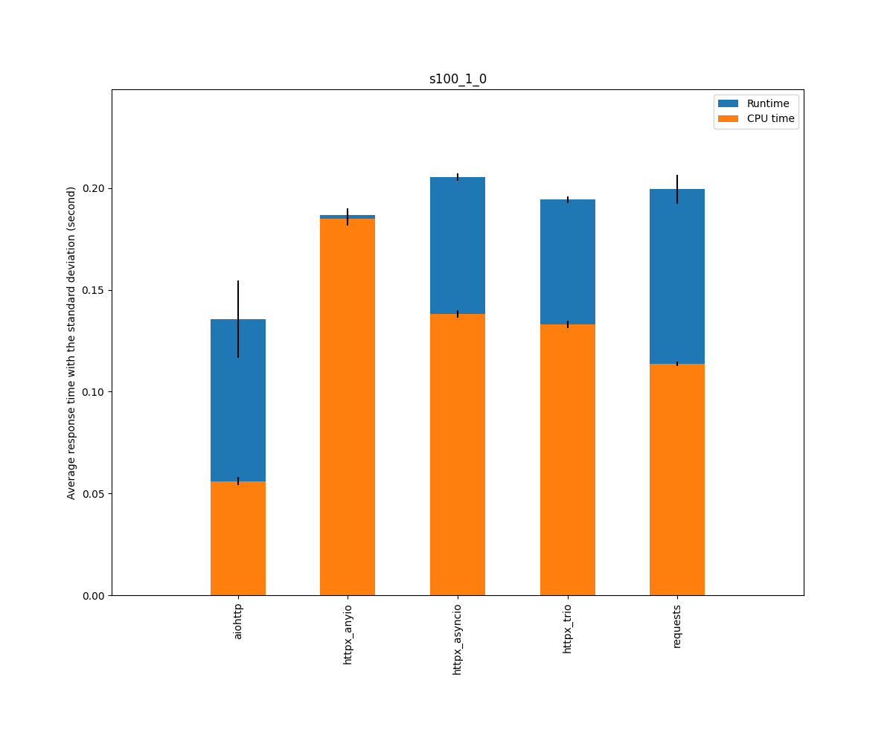
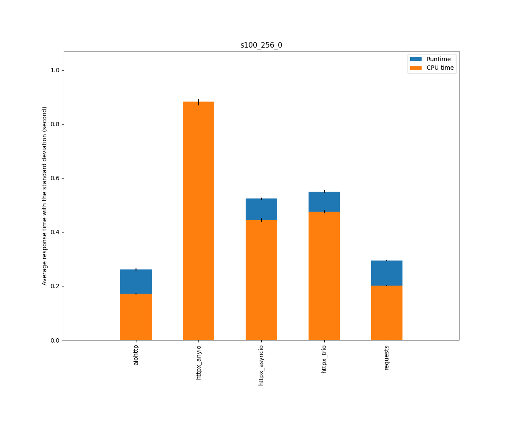
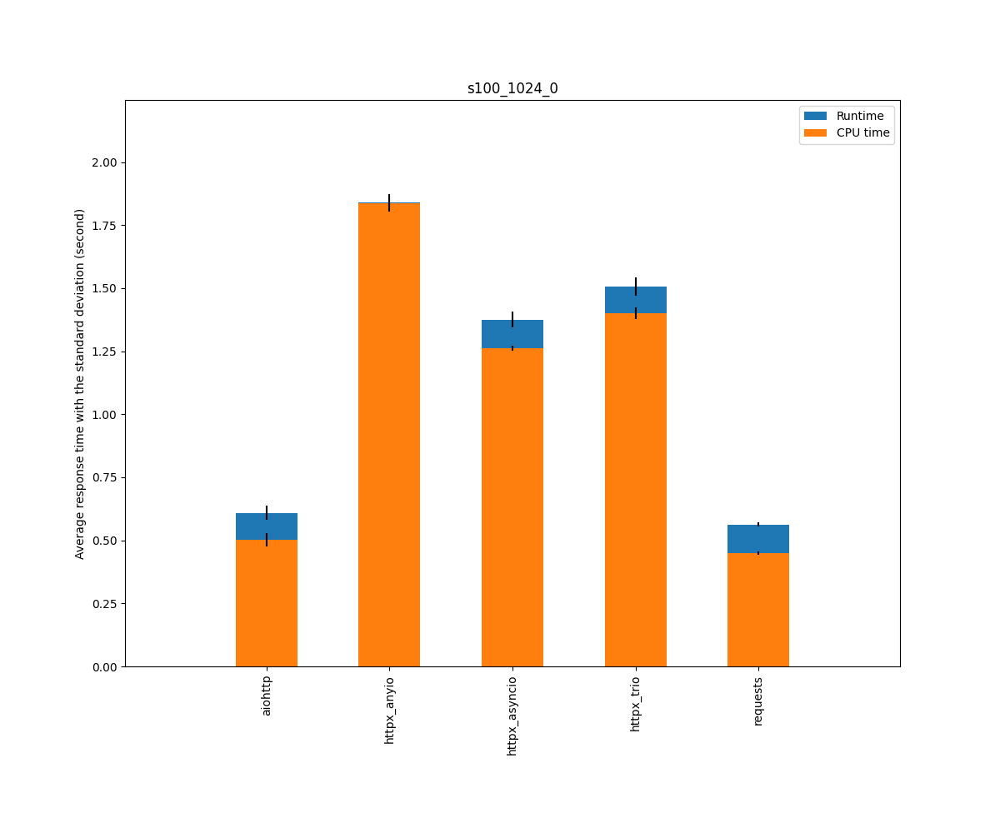

## Versions

* Python                         3.8.5 (default, Jul 28 2020, 12:59:40) [GCC 9.3.0]
* aiohttp                        3.7.3
* httpx                          0.16.1
* httpcore                       0.12.2
* requests                       2.25.0
* uvloop                         0.14.0
* trio                           0.17.0
* curio                          1.4

## Context

* Cases: aiohttp, httpcore_curio_True, httpcore_curio_False, httpcore_trio_True, httpcore_trio_False, httpcore_uvloop_True, httpcore_uvloop_False, httpx_uvloop_True, httpx_uvloop_False, requests_1, requests_4
* Scenarios: external_p6_t5_p6, p6-8-5_t5_p6-8-5, p6-400-5_t5_p6-400-5, p100-2-5_t5_p100-2-5, s100_1_0, s100_2_0, s100_256_0, s100_1024_0, s30_8_4, p100_2048_5_t20_p100_2048_5, p60_1024_5
* Tries: default

## Scenario external_p6_t5_p6: External requests: Two sequences of searx requests, 0.5s in between

|                                  | Runtime |         |         | Cputime |         |         |
|----------------------------------|---------|---------|---------|---------|---------|---------|
|                                  |  median |    mean |   stdev |  median |    mean |   stdev |
| aiohttp                          |    1.39 |    1.38 |    0.06 |    0.09 |    0.09 |    0.01 |
| httpcore_curio_True              |    1.36 |    1.41 |    0.15 |    0.19 |    0.18 |    0.02 |
| httpcore_curio_False             |    1.43 |    1.47 |    0.20 |    0.14 |    0.14 |    0.01 |
| httpcore_trio_True               |    1.42 |    1.43 |    0.20 |    0.25 |    0.24 |    0.03 |
| httpcore_trio_False              |    1.47 |    1.46 |    0.18 |    0.23 |    0.22 |    0.02 |
| httpcore_uvloop_True             |    1.34 |    1.42 |    0.19 |    0.14 |    0.14 |    0.01 |
| httpcore_uvloop_False            |    1.52 |    1.46 |    0.16 |    0.11 |    0.11 |    0.01 |
| httpx_uvloop_True                |    1.17 |    1.18 |    0.09 |    0.16 |    0.16 |    0.02 |
| httpx_uvloop_False               |    1.31 |    1.42 |    0.36 |    0.13 |    0.13 |    0.01 |
| requests_1                       |    1.45 |    1.45 |    0.06 |    0.24 |    0.24 |    0.02 |
| requests_4                       |    1.32 |    1.35 |    0.14 |    0.31 |    0.31 |    0.05 |

## Scenario p6-8-5_t5_p6-8-5: Two sequences of 6 requests with a 8KB responses (various delays), 0.5s in between

|                                  | Runtime |         |         | Cputime |         |         |
|----------------------------------|---------|---------|---------|---------|---------|---------|
|                                  |  median |    mean |   stdev |  median |    mean |   stdev |
| aiohttp                          |    1.42 |    1.42 |    0.01 |    0.04 |    0.04 |    0.00 |
| httpcore_curio_True              |    1.41 |    1.41 |    0.00 |    0.08 |    0.08 |    0.00 |
| httpcore_curio_False             |    1.43 |    1.43 |    0.01 |    0.06 |    0.07 |    0.01 |
| httpcore_trio_True               |    1.42 |    1.42 |    0.00 |    0.10 |    0.10 |    0.00 |
| httpcore_trio_False              |    1.44 |    1.44 |    0.01 |    0.10 |    0.09 |    0.01 |
| httpcore_uvloop_True             |    1.42 |    1.42 |    0.00 |    0.06 |    0.06 |    0.00 |
| httpcore_uvloop_False            |    1.42 |    1.42 |    0.01 |    0.04 |    0.04 |    0.00 |
| httpx_uvloop_True                |    1.43 |    1.42 |    0.00 |    0.08 |    0.08 |    0.01 |
| httpx_uvloop_False               |    1.43 |    1.43 |    0.01 |    0.08 |    0.07 |    0.00 |
| requests_1                       |    1.45 |    1.44 |    0.01 |    0.10 |    0.10 |    0.01 |
| requests_4                       |    1.44 |    1.44 |    0.01 |    0.10 |    0.10 |    0.02 |

## Scenario p6-400-5_t5_p6-400-5: Two sequences of 6 requests with a 400KB responses (various delays), 0.5s in between

|                                  | Runtime |         |         | Cputime |         |         |
|----------------------------------|---------|---------|---------|---------|---------|---------|
|                                  |  median |    mean |   stdev |  median |    mean |   stdev |
| aiohttp                          |    1.44 |    1.44 |    0.01 |    0.10 |    0.10 |    0.01 |
| httpcore_curio_True              |    1.44 |    1.43 |    0.01 |    0.28 |    0.28 |    0.02 |
| httpcore_curio_False             |    1.44 |    1.44 |    0.00 |    0.17 |    0.16 |    0.01 |
| httpcore_trio_True               |    1.45 |    1.45 |    0.01 |    0.32 |    0.32 |    0.02 |
| httpcore_trio_False              |    1.45 |    1.45 |    0.01 |    0.25 |    0.25 |    0.01 |
| httpcore_uvloop_True             |    1.43 |    1.43 |    0.01 |    0.15 |    0.15 |    0.02 |
| httpcore_uvloop_False            |    1.43 |    1.43 |    0.01 |    0.10 |    0.10 |    0.01 |
| httpx_uvloop_True                |    1.44 |    1.44 |    0.01 |    0.19 |    0.20 |    0.01 |
| httpx_uvloop_False               |    1.44 |    1.44 |    0.01 |    0.17 |    0.17 |    0.02 |
| requests_1                       |    1.44 |    1.44 |    0.01 |    0.17 |    0.16 |    0.02 |
| requests_4                       |    1.44 |    1.44 |    0.01 |    0.16 |    0.16 |    0.03 |

## Scenario p100-2-5_t5_p100-2-5: Two sequences of 100 parallel requests (various delays), 0.5s in between

|                                  | Runtime |         |         | Cputime |         |         |
|----------------------------------|---------|---------|---------|---------|---------|---------|
|                                  |  median |    mean |   stdev |  median |    mean |   stdev |
| aiohttp                          |    1.95 |    1.93 |    0.05 |    0.37 |    0.37 |    0.05 |
| httpcore_curio_True              |    1.48 |    1.48 |    0.02 |    0.45 |    0.43 |    0.06 |
| httpcore_curio_False             |    1.66 |    1.67 |    0.05 |    0.70 |    0.70 |    0.10 |
| httpcore_trio_True               |    1.49 |    1.49 |    0.01 |    0.49 |    0.48 |    0.05 |
| httpcore_trio_False              |    1.63 |    1.64 |    0.04 |    0.73 |    0.73 |    0.05 |
| httpcore_uvloop_True             |    1.49 |    1.49 |    0.02 |    0.27 |    0.26 |    0.04 |
| httpcore_uvloop_False            |    1.60 |    1.60 |    0.03 |    0.41 |    0.41 |    0.04 |
| httpx_uvloop_True                |    1.49 |    1.49 |    0.01 |    0.43 |    0.41 |    0.04 |
| httpx_uvloop_False               |    1.96 |    1.96 |    0.02 |    0.76 |    0.76 |    0.04 |
| requests_1                       |    1.64 |    1.66 |    0.05 |    0.98 |    1.02 |    0.12 |
| requests_4                       |    1.68 |    1.75 |    0.20 |    1.03 |    1.16 |    0.33 |

## Scenario s100_1_0: 100 sequential requests, 1 byte response, 0 delay

|                                  | Runtime |         |         | Cputime |         |         |
|----------------------------------|---------|---------|---------|---------|---------|---------|
|                                  |  median |    mean |   stdev |  median |    mean |   stdev |
| aiohttp                          |    0.10 |    0.10 |    0.01 |    0.04 |    0.04 |    0.00 |
| httpcore_curio_True              |    0.13 |    0.13 |    0.01 |    0.08 |    0.08 |    0.01 |
| httpcore_curio_False             |    0.09 |    0.10 |    0.02 |    0.05 |    0.06 |    0.01 |
| httpcore_trio_True               |    0.16 |    0.16 |    0.01 |    0.11 |    0.12 |    0.01 |
| httpcore_trio_False              |    0.11 |    0.11 |    0.00 |    0.08 |    0.08 |    0.00 |
| httpcore_uvloop_True             |    0.13 |    0.13 |    0.01 |    0.07 |    0.07 |    0.00 |
| httpcore_uvloop_False            |    0.10 |    0.11 |    0.01 |    0.05 |    0.05 |    0.00 |
| httpx_uvloop_True                |    0.17 |    0.18 |    0.02 |    0.11 |    0.11 |    0.01 |
| httpx_uvloop_False               |    0.13 |    0.13 |    0.01 |    0.09 |    0.09 |    0.00 |
| requests_1                       |    0.15 |    0.16 |    0.01 |    0.10 |    0.10 |    0.01 |
| requests_4                       |    0.16 |    0.17 |    0.02 |    0.10 |    0.11 |    0.01 |

## Scenario s100_2_0: 100 sequential requests, 2KB response, 0 delay

|                                  | Runtime |         |         | Cputime |         |         |
|----------------------------------|---------|---------|---------|---------|---------|---------|
|                                  |  median |    mean |   stdev |  median |    mean |   stdev |
| aiohttp                          |    0.10 |    0.10 |    0.01 |    0.04 |    0.05 |    0.00 |
| httpcore_curio_True              |    0.13 |    0.13 |    0.01 |    0.08 |    0.08 |    0.01 |
| httpcore_curio_False             |    0.09 |    0.09 |    0.01 |    0.05 |    0.05 |    0.00 |
| httpcore_trio_True               |    0.16 |    0.16 |    0.01 |    0.11 |    0.11 |    0.01 |
| httpcore_trio_False              |    0.11 |    0.11 |    0.01 |    0.08 |    0.08 |    0.00 |
| httpcore_uvloop_True             |    0.12 |    0.14 |    0.04 |    0.07 |    0.07 |    0.02 |
| httpcore_uvloop_False            |    0.10 |    0.10 |    0.01 |    0.05 |    0.05 |    0.00 |
| httpx_uvloop_True                |    0.18 |    0.19 |    0.02 |    0.12 |    0.12 |    0.01 |
| httpx_uvloop_False               |    0.14 |    0.15 |    0.02 |    0.09 |    0.10 |    0.01 |
| requests_1                       |    0.16 |    0.17 |    0.01 |    0.11 |    0.11 |    0.00 |
| requests_4                       |    0.17 |    0.18 |    0.02 |    0.11 |    0.12 |    0.01 |

## Scenario s100_256_0: 100 sequential requests, 256KB response, 0 delay

|                                  | Runtime |         |         | Cputime |         |         |
|----------------------------------|---------|---------|---------|---------|---------|---------|
|                                  |  median |    mean |   stdev |  median |    mean |   stdev |
| aiohttp                          |    0.18 |    0.18 |    0.01 |    0.11 |    0.12 |    0.01 |
| httpcore_curio_True              |    0.61 |    0.61 |    0.03 |    0.42 |    0.42 |    0.02 |
| httpcore_curio_False             |    0.21 |    0.21 |    0.01 |    0.17 |    0.17 |    0.01 |
| httpcore_trio_True               |    0.50 |    0.54 |    0.12 |    0.45 |    0.49 |    0.11 |
| httpcore_trio_False              |    0.30 |    0.31 |    0.03 |    0.26 |    0.27 |    0.02 |
| httpcore_uvloop_True             |    0.23 |    0.23 |    0.01 |    0.17 |    0.17 |    0.01 |
| httpcore_uvloop_False            |    0.16 |    0.16 |    0.01 |    0.11 |    0.11 |    0.01 |
| httpx_uvloop_True                |    0.35 |    0.35 |    0.03 |    0.28 |    0.28 |    0.02 |
| httpx_uvloop_False               |    0.26 |    0.27 |    0.02 |    0.21 |    0.21 |    0.01 |
| requests_1                       |    0.22 |    0.23 |    0.01 |    0.17 |    0.17 |    0.01 |
| requests_4                       |    0.24 |    0.25 |    0.01 |    0.18 |    0.18 |    0.00 |

## Scenario s100_1024_0: 100 sequential requests, 1MB response, 0 delay

|                                  | Runtime |         |         | Cputime |         |         |
|----------------------------------|---------|---------|---------|---------|---------|---------|
|                                  |  median |    mean |   stdev |  median |    mean |   stdev |
| aiohttp                          |    0.39 |    0.40 |    0.02 |    0.31 |    0.32 |    0.02 |
| httpcore_curio_True              |    1.72 |    1.74 |    0.09 |    1.36 |    1.37 |    0.08 |
| httpcore_curio_False             |    0.57 |    0.58 |    0.02 |    0.53 |    0.54 |    0.02 |
| httpcore_trio_True               |    1.55 |    1.57 |    0.09 |    1.49 |    1.51 |    0.09 |
| httpcore_trio_False              |    0.92 |    0.90 |    0.06 |    0.88 |    0.85 |    0.06 |
| httpcore_uvloop_True             |    0.52 |    0.53 |    0.04 |    0.45 |    0.46 |    0.03 |
| httpcore_uvloop_False            |    0.38 |    0.38 |    0.01 |    0.32 |    0.32 |    0.01 |
| httpx_uvloop_True                |    0.84 |    0.85 |    0.07 |    0.75 |    0.76 |    0.07 |
| httpx_uvloop_False               |    0.64 |    0.64 |    0.03 |    0.57 |    0.57 |    0.03 |
| requests_1                       |    0.55 |    0.56 |    0.03 |    0.47 |    0.48 |    0.02 |
| requests_4                       |    0.56 |    0.58 |    0.06 |    0.48 |    0.50 |    0.05 |

## Scenario s30_8_4: One sequence of 30 requests, 8KB response, 400ms delay

|                                  | Runtime |         |         | Cputime |         |         |
|----------------------------------|---------|---------|---------|---------|---------|---------|
|                                  |  median |    mean |   stdev |  median |    mean |   stdev |
| aiohttp                          |    0.46 |    0.46 |    0.02 |    0.05 |    0.05 |    0.01 |
| httpcore_curio_True              |    0.44 |    0.45 |    0.01 |    0.05 |    0.05 |    0.01 |
| httpcore_curio_False             |    0.46 |    0.46 |    0.01 |    0.07 |    0.08 |    0.01 |
| httpcore_trio_True               |    0.45 |    0.46 |    0.01 |    0.06 |    0.06 |    0.01 |
| httpcore_trio_False              |    0.48 |    0.47 |    0.01 |    0.11 |    0.11 |    0.01 |
| httpcore_uvloop_True             |    0.43 |    0.43 |    0.01 |    0.03 |    0.04 |    0.01 |
| httpcore_uvloop_False            |    0.46 |    0.46 |    0.01 |    0.06 |    0.05 |    0.01 |
| httpx_uvloop_True                |    0.45 |    0.45 |    0.01 |    0.05 |    0.05 |    0.01 |
| httpx_uvloop_False               |    0.47 |    0.46 |    0.01 |    0.10 |    0.09 |    0.01 |
| requests_1                       |    0.49 |    0.48 |    0.01 |    0.18 |    0.18 |    0.02 |
| requests_4                       |    0.50 |    0.49 |    0.01 |    0.20 |    0.19 |    0.02 |

## Scenario p100_2048_5_t20_p100_2048_5: 2 sequences of 100 requests, between 2KB and 2MB responses (various delays), 2s in between

|                                  | Runtime |         |         | Cputime |         |         |
|----------------------------------|---------|---------|---------|---------|---------|---------|
|                                  |  median |    mean |   stdev |  median |    mean |   stdev |
| aiohttp                          |    3.03 |    3.03 |    0.01 |    0.74 |    0.74 |    0.04 |
| httpcore_curio_True              |    3.18 |    3.19 |    0.01 |    1.56 |    1.56 |    0.04 |
| httpcore_curio_False             |    3.02 |    3.02 |    0.00 |    1.08 |    1.08 |    0.02 |
| httpcore_trio_True               |    3.22 |    3.26 |    0.10 |    1.78 |    1.84 |    0.20 |
| httpcore_trio_False              |    3.07 |    3.08 |    0.01 |    1.38 |    1.38 |    0.04 |
| httpcore_uvloop_True             |    3.06 |    3.06 |    0.02 |    0.82 |    0.83 |    0.03 |
| httpcore_uvloop_False            |    3.02 |    3.02 |    0.01 |    0.72 |    0.72 |    0.02 |
| httpx_uvloop_True                |    3.15 |    3.14 |    0.01 |    1.16 |    1.16 |    0.02 |
| httpx_uvloop_False               |    3.07 |    3.07 |    0.01 |    1.20 |    1.22 |    0.06 |
| requests_1                       |    3.26 |    3.25 |    0.09 |    2.66 |    2.72 |    0.40 |
| requests_4                       |    3.34 |    3.39 |    0.23 |    3.11 |    3.11 |    0.65 |

## Scenario p60_1024_5: 60 requests, 1MB response (various delays)

|                                  | Runtime |         |         | Cputime |         |         |
|----------------------------------|---------|---------|---------|---------|---------|---------|
|                                  |  median |    mean |   stdev |  median |    mean |   stdev |
| aiohttp                          |    1.05 |    1.05 |    0.02 |    0.39 |    0.40 |    0.02 |
| httpcore_curio_True              |    1.21 |    1.21 |    0.01 |    0.84 |    0.84 |    0.01 |
| httpcore_curio_False             |    1.07 |    1.07 |    0.02 |    0.52 |    0.53 |    0.02 |
| httpcore_trio_True               |    1.31 |    1.31 |    0.04 |    0.94 |    0.94 |    0.04 |
| httpcore_trio_False              |    1.07 |    1.07 |    0.02 |    0.70 |    0.70 |    0.01 |
| httpcore_uvloop_True             |    0.99 |    0.99 |    0.01 |    0.44 |    0.44 |    0.01 |
| httpcore_uvloop_False            |    1.05 |    1.06 |    0.02 |    0.38 |    0.38 |    0.01 |
| httpx_uvloop_True                |    1.06 |    1.05 |    0.01 |    0.61 |    0.61 |    0.02 |
| httpx_uvloop_False               |    1.03 |    1.03 |    0.02 |    0.54 |    0.55 |    0.03 |
| requests_1                       |    1.12 |    1.15 |    0.14 |    1.17 |    1.38 |    0.38 |
| requests_4                       |    1.09 |    1.17 |    0.14 |    1.28 |    1.41 |    0.39 |

